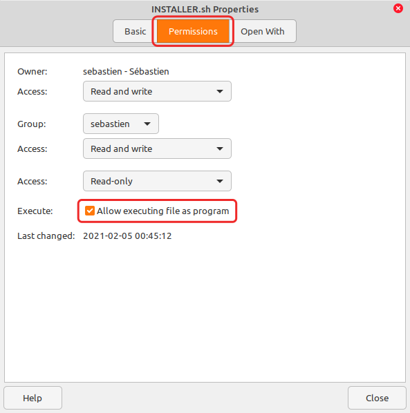

NOTE: This is just an animated GIF preview. The real thing is better, with a perfect color gradient.

# mint-logo-2: A new Plymouth theme for Linux Mint
This is a new version for your animated boot screen. This logo here is twice as large as the standard one. My boot screen is full HD: 1920 X 1080 pixels. In my humble opinion, the standard Mint Plymouth theme looked a bit "cheap", being too small for this full HD screen. It almost felt like there was just a small "dot" displayed there. Now this new logo is double-sized at 200 pixels large. This works best on FHD screens, but i also tested it on my old little netbook, with a 1024 X 600 pixels boot screen. On this small netbook this new logo may look a bit big, but it still works.

And everything is completely redesigned here, with a clearly noticeable animation and a nice mint flavored background. And yet, it is still discreet, not too flashy.



### How to install
1. [Download ZIP here](https://github.com/SebastJava/plymouth-theme-mint-logo-2/archive/refs/heads/main.zip) (OR click on top-right green button "Code" and then click on "Download ZIP".)
1. Extract this entire zip.
1. Make sure **INSTALLER.sh** is allowed to execute as program: File > Properties > Permissions > **Allow executing file as program.** (See screenshot) OR type `chmod +x /PATH/TO/THIS/DIRECTORY/INSTALLER.sh` in the terminal. (This is probably already okay.)
1. Open your Terminal into this new downloaded and extracted directory: `cd /PATH/TO/THIS/PLYMOUTH-THEME`
1. In your Terminal, type `./INSTALLER.sh` and press Enter.
1. Restart and check the results!

### How to revert to the original mint-logo
1. Make sure **REVERT.sh** is allowed to execute as program, just like you did for INSTALLER.sh, as described above. (This is probably already okay.)
1. Open your Terminal into this new downloaded and extracted directory: `cd /PATH/TO/THIS/PLYMOUTH-THEME`
1. In your Terminal, type `./REVERT.sh` and press Enter.
1. Restart and check the results!

### How to check things (optional)
You can check things with this command:
`update-alternatives --display default.plymouth`

You can preview your default Plymouth theme using the `preview.sh` script. You must run this script as root. To do so, you need to open your Terminal in this downloaded plymouth-theme-mint-logo-2 directory and run this script this way:

```
cd /PATH/TO/THIS/PLYMOUTH-THEME
sudo ./preview.sh
```

This will preview the splash screen for 10 seconds. You can change this default 10 seconds by adding XX seconds at the end of the command. Example:

```sudo ./preview.sh 20```

for a 20 seconds preview.

### Credits
Written by: Alberto Milone <alberto.milone@canonical.com> <br>
Adapted to Ubuntu GNOME by: Alfredo Hernández <aldomann.designs@gmail.com> <br>
Adapted to Linux Mint by: Clément Lefebvre <root@linuxmint.com> <br>
Modified for Linux Mint by: Sébastien Bouchard <sebastjava@hotmail.ca> <br>
Based on the example provided with the "script plugin" written by: Charlie Brej <cbrej@cs.man.ac.uk> <br>
Question stuff written by: Markus Waas <mail@markuswaas.de> <br>
<br>